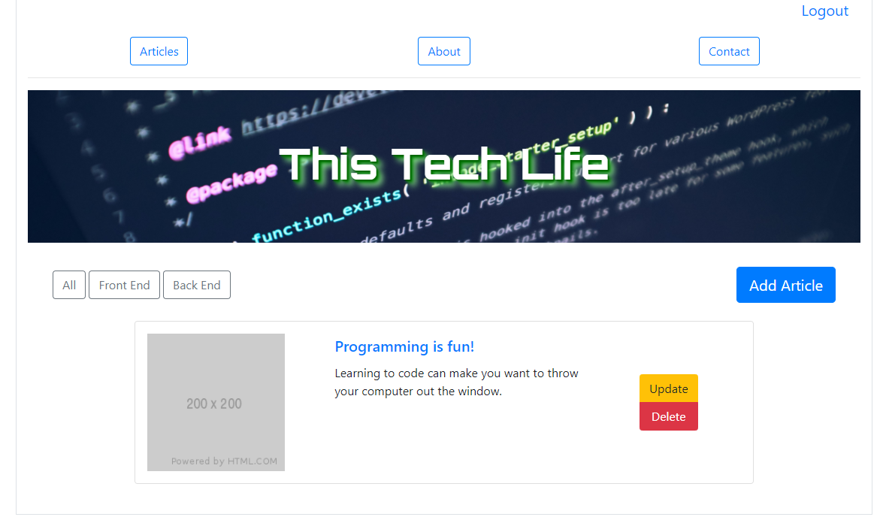

# Project_2

**Name: This Tech Life**

**Description:**
This is a blog web site that has one author and many content consumers. As the author of the web site you can add, read, edit, and delete blogs. When the author creates their articles it is defaulted in English and then taken and translated into four additional languages via an api call and then results are stored into our database. As a user I can select from categories to sort out articles. Once the user opens an article they can select which language to have the article displayed in.

**User Story**
AS A bilingual blogger
I WANT distribute my content to my readers in my preferred language
WHILE ALSO allowing readers of other languages to view my product in their preferred language
SO THAT my product can reach a wider audience and allow me to connect with people all over the world

**Acceptance Criteria**
GIVEN a blog site
WHEN a user logs into the app
THEN they are able to add, read, delete blog posts
WHEN a user chooses to add
THEN they are brought to a new blog post screen
WHEN a user chooses to read
THEN they are presented with a page of existing blog posts
WHEN a user chooses a category
THEN posts pertaining to their selected category are displayed
WHEN a user chooses to delete
THEN they are presented a page of their existing blog posts, so they can choose which one to delete

WHEN users who are not the author view the blog site
THEN they can select categories, or view all blog posts

**Screenshot**

**Link**
[ThisTechLife](https://projecto-2.herokuapp.com/)

**Usage / Installation**

1. NPM install
2. Set .env file inside root of repo.  Add Db password and API key for Google Translate
3. Go to MySQL and create the DB (without the tables)
4. Run 'node server' in the terminal. Stop the server.
5. Go to seeders file and use the seed.js file. Configure your user name and password for the admin.
6. Run 'npx sequelize-cli db:seed:all'
7. Run 'node server' and log into your web browser.

**Tech Stack**
- Sequelize
- Passport
- Handlebars
- Google Translate API
- Chai
- Travis
- ESLint
  

**Roadmap/Future Development Opportunities**
 - Expand to more languages
 - Allow the author to enter a blog post in a language other than English.
 - Allow the author to create their own categories.
 - Add more images to the app
  

